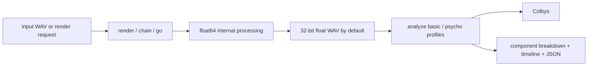

# UglySoundGenerator

UglySoundGenerator (`usg`) is a Rust command-line instrument for rendering, chaining, analyzing, and forcing sounds toward deliberate sonic ugliness.

It is best understood as **three core tools** with a few power-user satellites:

- `render`: synthesize ugly material from scratch
- `piece`: assemble a multichannel piece from many short ugly events
- `chain`: route a render or preset pipeline through multiple stages
- `analyze`: measure the result in **Colbys**

Advanced tools such as `go`, `mutate`, `normalize-pack`, `evolve`, and `speech` build on those three surfaces rather than replacing them.

## Quickstart

Build:

```bash
cargo build
```

Render a default file:

```bash
cargo run -- render --output out/harsh.wav --duration 2.0 --style harsh
```

Analyze it:

```bash
cargo run -- analyze out/harsh.wav
cargo run -- analyze out/harsh.wav --json
```

Force an existing file to a target ugliness in Colbys:

```bash
cargo run -- go out/harsh.wav --level 650 --type punish --output out/harsh.go.wav
```

Build a chain:

```bash
cargo run -- chain --stages style:glitch,stutter,pop --duration 3.0 --output out/chain.wav
```

Render a stereo ugly piece made of many short sounds:

```bash
cargo run -- piece --output out/piece.wav --duration 20 --channels 2 --events-per-second 7
```

Render an Atmos-style piece with height channels:

```bash
cargo run -- piece --output out/piece_714.wav --duration 30 --layout 7.1.4 --events-per-second 9
```

## One Metric, One Meaning

USG uses a single public ugliness unit: **Colbys (Co)**.

- `-1000 Co`: cleanest / least ugly
- `0 Co`: neutral center
- `+1000 Co`: most ugly

`go --level` always means **target Colbys**. Internally, the engine maps that target to a normalized drive intensity in the range `0.0..1.0`, but that is an implementation detail, not a second public scoring system.

## Product Boundary

The repo has a lot in it, so the intended hierarchy matters:

1. Core creation: `render`, `piece`, `chain`, `go`
2. Core inspection: `analyze`
3. Support surfaces: `presets`, `backends`, `benchmark`
4. Power tools: `mutate`, `normalize-pack`, `evolve`, `speech`, `speech-pack`, `marathon`

If you are new to the project, start with the first two layers and ignore the rest until you need them.

## Command Map

| Area | What it does | Primary doc |
| --- | --- | --- |
| Rendering | Create ugly sounds from scratch | [docs/COMMANDS.md](docs/COMMANDS.md) |
| Chaining | Route synthesis/effects through multiple stages | [docs/COMMANDS.md](docs/COMMANDS.md) |
| Analysis | Measure ugliness and psychoacoustic features | [docs/METRICS.md](docs/METRICS.md) |
| Psychoacoustics | Equations, assumptions, references, joke metric | [docs/PSYCHOACOUSTICS.md](docs/PSYCHOACOUSTICS.md) |
| Roadmap | Planned milestones and direction of travel | [docs/ROADMAP.md](docs/ROADMAP.md) |
| Example corpus | 333 reproducible WAV examples | [README_EXAMPLES.md](README_EXAMPLES.md) |

## Core Examples

Render at the default house format of float32 / 192 kHz / 0 dBFS normalization:

```bash
cargo run -- render --output out/default.wav --duration 1.5 --style punish
```

Render explicit integer output:

```bash
cargo run -- render --output out/int24.wav --duration 1.5 --style buzz --sample-format int --bit-depth 24
```

Analyze a timeline instead of one whole-file score:

```bash
cargo run -- analyze out/default.wav --timeline --timeline-format csv --timeline-output out/default.timeline.csv
```

Use a contour preset while uglifying an input:

```bash
cargo run -- go out/input.wav \
  --type glitch \
  --level-contour presets/go_contours/12_step_pattern_01.json \
  --output out/input.glitched.wav
```

Upmix while uglifying:

```bash
cargo run -- go out/input.wav \
  --level 720 \
  --type punish \
  --upmix 5.1 \
  --coords polar \
  --locus 1.0,45.0,0.0 \
  --trajectory orbit:1.0,3.0 \
  --output out/input.51.wav
```

## Example Corpus

The repo ships a `333`-file WAV corpus under `examples/audio/` plus exact reproduction commands in [README_EXAMPLES.md](README_EXAMPLES.md).

That material intentionally lives out of the main README so the front page stays focused on orientation, not on a wall of embedded media and long command inventories.

Regenerate the corpus from the repo root with:

```bash
./scripts/generate_example_corpus.sh
```

## Verification

USG now treats verification as part of the product surface, not an afterthought.

- CI checks Linux and macOS builds
- CLI smoke tests cover core flows
- `scripts/verify_repo.sh` audits repo structure and corpus expectations
- analysis JSON now exposes score profile metadata so consumers can see which heuristic produced a score

## Architecture Sketch



## Reading Order

1. [docs/COMMANDS.md](docs/COMMANDS.md)
2. [docs/METRICS.md](docs/METRICS.md)
3. [docs/PSYCHOACOUSTICS.md](docs/PSYCHOACOUSTICS.md)
4. [docs/ROADMAP.md](docs/ROADMAP.md)
5. [README_EXAMPLES.md](README_EXAMPLES.md)
