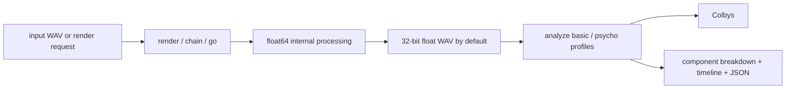

# UglySoundGenerator

UglySoundGenerator (`usg`) is a Rust command-line instrument for rendering, chaining, analyzing, and forcing sounds toward deliberate sonic ugliness.

The project is partly an audio tool, partly a testbed for deliberately hostile synthesis, and partly a straight-faced joke about quantifying things that probably should not be quantified this aggressively. The serious side is useful for generating regression fixtures, stress-testing audio pipelines, building chiptune speech packs, and exploring roughness/dissonance features. The unserious side is why the unit is called a Colby and why `analyze --joke` exists.

It is best understood as **three core tools** with a few power-user satellites:

- `render`: synthesize ugly material from scratch
- `piece`: assemble a multichannel piece from many short ugly events
- `chain`: route a render or preset pipeline through multiple stages
- `analyze`: measure the result in acoustical ugliness units of **Colbys**

Advanced tools such as `go`, `mutate`, `normalize-pack`, `evolve`, `speech`, and `speech-pack` build on those three surfaces rather than replacing them.

## Quickstart

Build from a checkout when you want the fastest local development loop:

```bash
cargo build
```

Install it into your user-local bin directory when you want `usg` available from any shell:

```bash
./scripts/install.sh
```

If you prefer a Python-oriented workflow, install the lightweight pip shim from the checkout and let it delegate to the Rust binary:

```bash
python3 -m pip install -e .
usg-pip-install
uglysoundgenerator --help
```

Homebrew users can install the current `main` branch from the bundled formula:

```bash
brew install --HEAD ./packaging/homebrew/usg.rb
```

Render a default file:

```bash
cargo run -- render --output out/harsh.wav --duration 2.0 --style harsh
```

Analyze it:

```bash
cargo run -- analyze out/harsh.wav
cargo run -- analyze out/harsh.wav --json
cargo run -- analyze out/harsh.wav --model psycho --explain
```

Force an existing file to a target ugliness in Colbys:

```bash
cargo run -- go out/harsh.wav --level 650 --type punish --output out/harsh.go.wav
```

Build a chain:

```bash
cargo run -- chain --stages style:glitch,stutter,pop --duration 3.0 --output out/chain.wav
```

Render chip-speech with parser/timeline exports:

```bash
cargo run -- speech \
  --text "WARNING 404. EVACUATE?" \
  --profile tms5220 \
  --input-mode sentence \
  --analysis-json out/warning.analysis.json \
  --timeline-json out/warning.timeline.json \
  --output out/warning_speech.wav
```

Render a stereo ugly piece made of many short sounds:

```bash
cargo run -- piece --output out/piece.wav --duration 20 --channels 2 --events-per-second 7
```

Render a one-minute piece that follows a rising ugliness trajectory:

```bash
cargo run -- piece --output out/rising_ugliness.wav --duration 60 --layout stereo --scene arcade-collapse --ugliness-trajectory-json '{"version":1,"interpolation":"linear","points":[{"t":0.0,"colbys":-700},{"t":0.5,"colbys":150},{"t":1.0,"colbys":950}]}' --manifest out/rising_ugliness.manifest.json --seed 43003
```

Render an Atmos-style piece with height channels:

```bash
cargo run -- piece --output out/piece_714.wav --duration 30 --layout 7.1.4 --events-per-second 9
```

## One Metric, One Meaning

USG uses a single public ugliness unit: **Colbys (Co)**.

- `-1000 Co`: cleanest / least ugly
- `0 Co`: neutral center
- `+1000 Co`: most ugly

`go --level` always means **target Colbys**. Internally, the engine maps that target to a normalized drive intensity in the range `0.0..1.0`, but that is an implementation detail, not a second public scoring system.

The metric docs are intentionally explicit about where the model is a heuristic. `docs/METRICS.md` defines the production score profiles, while `docs/PSYCHOACOUSTICS.md` gives the literature background and the ceremonial UglierBasis equation. The joke equation is implemented only when you ask for it with `analyze --joke`; it does not contaminate the real score fields.

## Product Boundary

The repo has a lot in it, so the intended hierarchy matters:

1. Core creation: `render`, `piece`, `chain`, `go`
2. Core inspection: `analyze`
3. Support surfaces: `presets`, `backends`, `benchmark`
4. Power tools: `mutate`, `normalize-pack`, `evolve`, `speech`, `speech-pack`, `marathon`

If you are new to the project, start with the first two layers and ignore the rest until you need them.

## Speech Surface

The v0.5 speech system is a power-user surface for ugly but inspectable chip speech. `speech` accepts inline text or a UTF-8 text file, normalizes text by default, parses it into character/word/sentence/paragraph units, and can export both psychoacoustic analysis JSON and a phoneme timeline JSON for parser diagnostics.

Current speech profiles are `votrax-sc01`, `tms5220`, `sp0256`, `mea8000`, `s14001a`, `c64-sam`, `arcadey90s`, `handheld-lcd`, `speak-and-spell`, `macintalk`, `yamaha-psg`, and `amiga-narrator`. Profiles map to chip-specific backend families (`lpc`, `formant-grid`, `sam-vocal-tract`, `arcade-pcm`, `delta-modulation`, `klatt-cascade`, or `psg-formant`) and can be combined with three oscillator slots selected from 34 oscillator choices plus 12 excitation families.

Use `speech-pack` when you want to compare every profile for the same text. It renders one WAV per profile, analyzes each one, computes an intelligibility index, and writes JSON, CSV, and HTML reports ranked by `ugliness`, `intelligibility`, or `balanced`.

The speech surface is designed for both one-off abuse and corpus work. Short words expose consonant timing problems. Sentences expose rhythm, stress, and intelligibility failures. Paragraphs expose drift, fatigue, and whether the chip backend can remain charmingly cursed for more than a few seconds. Exported timelines make it possible to inspect phoneme boundaries without reverse-engineering the rendered waveform.

Useful speech experiments:

```bash
cargo run -- speech --text "SYNTHESIS IS A HAUNTED TOASTER" --profile sp0256 --oscillator-a lfsr --oscillator-b formant --oscillator-c koch --output out/sp0256_toaster.wav
cargo run -- speech-pack --text "THE QUICK BROWN FOX GLITCHES OVER THE LAZY DAC" --rank-by balanced --output-dir out/speech-pack
cargo run -- speech --text-file docs/ROADMAP.md --input-mode paragraph --profile macintalk --timeline-json out/roadmap.timeline.json --analysis-json out/roadmap.analysis.json --output out/roadmap_voice.wav
```

## Command Map

| Area | What it does | Primary doc |
| --- | --- | --- |
| Rendering | Create ugly sounds from scratch | [docs/COMMANDS.md](docs/COMMANDS.md) |
| Chaining | Route synthesis/effects through multiple stages | [docs/COMMANDS.md](docs/COMMANDS.md) |
| Analysis | Measure ugliness and psychoacoustic features | [docs/METRICS.md](docs/METRICS.md) |
| Psychoacoustics | Equations, assumptions, references, joke metric | [docs/PSYCHOACOUSTICS.md](docs/PSYCHOACOUSTICS.md) |
| Speech | Chip profiles, phoneme timelines, intelligibility-vs-ugliness packs | [docs/COMMANDS.md](docs/COMMANDS.md) |
| Roadmap | Planned milestones and direction of travel | [docs/ROADMAP.md](docs/ROADMAP.md) |
| Example corpus | 333 reproducible WAV examples | [README_EXAMPLES.md](README_EXAMPLES.md) |

## Core Examples

Render at the default house format of float32 / 192 kHz / 0 dBFS normalization:

```bash
cargo run -- render --output out/default.wav --duration 1.5 --style punish
```

Render explicit integer output:

```bash
cargo run -- render --output out/int24.wav --duration 1.5 --style buzz --sample-format int --bit-depth 24
```

Analyze a timeline instead of one whole-file score:

```bash
cargo run -- analyze out/default.wav --timeline --timeline-format csv --timeline-output out/default.timeline.csv
```

Use a contour preset while uglifying an input:

```bash
cargo run -- go out/input.wav \
  --type glitch \
  --level-contour presets/go_contours/12_step_pattern_01.json \
  --output out/input.glitched.wav
```

Upmix while uglifying:

```bash
cargo run -- go out/input.wav \
  --level 720 \
  --type punish \
  --upmix 5.1 \
  --coords polar \
  --locus 1.0,45.0,0.0 \
  --trajectory orbit:1.0,3.0 \
  --output out/input.51.wav
```

## Example Corpus

The repo ships a `333`-file WAV corpus under `examples/audio/` plus exact reproduction commands in [README_EXAMPLES.md](README_EXAMPLES.md).

That material intentionally lives out of the main README so the front page stays focused on orientation, not on a wall of embedded media and long command inventories.

The corpus is not just a demo shelf. It is meant to act like a listening map for the whole project: basic renders, chained effects, contour-driven uglification, multichannel layouts, speech profiles, oscillator variants, and seeded random pieces. The commands are deterministic where seeds are supplied, which makes them useful for bug reports and comparisons across releases.

Good first listening paths:

- Start with `00_source_hum.wav`, then compare the `go` outputs to hear how a tame input is punished.
- Scan the render grid by style name if you are tuning a single synthesis family.
- Compare the speech grid when changing phoneme parsing or chip backend behavior.
- Use the piece examples when testing panning, channel layout, and trajectory-driven density.

Regenerate the corpus from the repo root with:

```bash
./scripts/generate_example_corpus.sh
```

## Install And Demos

Install from this checkout with the shell installer:

```bash
./scripts/install.sh
```

The installer uses `cargo install --locked --path . --root "$PREFIX"` and writes `usg` to `${PREFIX:-$HOME/.local}/bin`.

Useful install variants:

```bash
PREFIX=/usr/local ./scripts/install.sh
FEATURES=metal ./scripts/install.sh
PROFILE=dev ./scripts/install.sh
```

If `$HOME/.local/bin` is not already on your shell path:

```bash
export PATH="$HOME/.local/bin:$PATH"
```

Pip support is intentionally a shim, not a second implementation of the synthesizer. It gives Python-heavy environments a console entry point and an installer helper while still using the Rust binary for DSP:

```bash
python3 -m pip install -e .
usg-pip-install
uglysoundgenerator render --duration 0.5 --style glitch --output out/pip_glitch.wav
```

The `uglysoundgenerator` command first delegates to `USG_BIN` if set, then to `usg` on `PATH`, and finally to `cargo run` when it can see this source checkout. That keeps editable installs pleasant without pretending the Python package is the audio engine.

Run focused demos:

```bash
./scripts/demo_piece_trajectory.sh
./scripts/demo_atmos_piece.sh
./scripts/demo_speech_pack.sh
./scripts/demo_analysis_joke.sh
```

`scripts/piecee.sh` is a deliberately nastier shortcut for `demo_piece_trajectory.sh`: it avoids the more obviously pitched styles, uses short dense events, pushes a mostly-high ugliness trajectory, and then applies a dissonance-expanding `go` pass.

Or run all of them:

```bash
./scripts/run_demos.sh
```

Demo scripts default to `out/demos`; set `OUT_DIR=/path/to/output` to redirect them. They use `cargo run --quiet --` by default, or you can point them at an installed binary:

```bash
USG_BIN=usg ./scripts/run_demos.sh
OUT_DIR=/tmp/usg-demos ./scripts/demo_piece_trajectory.sh
```

Homebrew users can install the current `main` branch from the bundled formula:

```bash
brew install --HEAD ./packaging/homebrew/usg.rb
```

If you maintain a personal tap, copy or symlink `packaging/homebrew/usg.rb` into your tap's `Formula/` directory. The formula is deliberately HEAD-oriented until release tarballs and checksums are published consistently.

Formula maintenance lives in the repo too:

```bash
./scripts/refresh_homebrew_formula.sh
```

That helper validates Ruby syntax everywhere and runs `brew audit --strict --online` when the local Homebrew/Xcode environment supports it.

## Verification

USG now treats verification as part of the product surface, not an afterthought.

- CI checks Linux and macOS builds
- CLI smoke tests cover core flows
- `scripts/verify_repo.sh` audits repo structure and corpus expectations
- `packaging/homebrew/usg.rb` provides a Homebrew formula for HEAD installs
- `pyproject.toml` provides pip-facing console scripts for source checkout workflows
- analysis JSON now exposes score profile metadata so consumers can see which heuristic produced a score

## Architecture Sketch



## Reading Order

1. [docs/COMMANDS.md](docs/COMMANDS.md)
2. [docs/METRICS.md](docs/METRICS.md)
3. [docs/PSYCHOACOUSTICS.md](docs/PSYCHOACOUSTICS.md)
4. [docs/ROADMAP.md](docs/ROADMAP.md)
5. [README_EXAMPLES.md](README_EXAMPLES.md)
