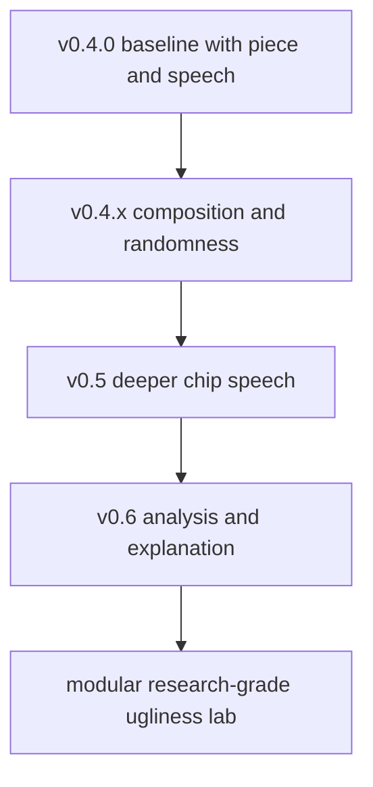

# Roadmap

This roadmap is meant to help people understand where `usg` is headed next, not to pretend every item is guaranteed.

The project is already strong at three things:

- rendering ugly sounds from scratch
- transforming existing sounds toward target ugliness
- analyzing results in transparent heuristic terms

The next milestones focus on making those surfaces deeper, more reproducible, and easier to explore.

## Current Baseline

As of `v0.4.0`, USG already includes:

- `render`, `piece`, `chain`, `go`, and `analyze` as the main product surface
- speech synthesis with chip-inspired profiles, phoneme timelines, and analysis export
- seeded reproducibility and controlled randomness knobs
- timeline and JSON analysis outputs
- contour-driven `go` processing and multichannel upmix workflows
- multichannel `piece` generation, including named Atmos-style layouts
- colored interactive progress feedback during piece assembly
- example corpus generation and repo verification scripts

## Near-Term Priorities

### `v0.4.x`: Composition And Randomness

Goal: make randomness and long-form generation feel like first-class composition surfaces rather than side options.

Planned work:

- expand seed controls so `render`, `speech`, `go`, `mutate`, `evolve`, and `marathon` expose a more uniform randomness contract
- keep the named randomness presets `stable`, `restless`, `feral`, and `catastrophic` aligned between CLI behavior and data presets
- expose separate timing, spectral, density, spatial, and articulation randomness on more commands
- add seed manifests so long-running batch jobs can be reproduced exactly from one file
- add “reroll just one layer” workflows for speech units, stages, and contours
- deepen `piece` with phrase-scale structure, section contrast, burst logic, and direct loading for reusable scene presets
- expand spatial composition beyond raw channel spread: motion curves, region constraints, and speaker-family targeting

### `v0.5`: Speech System Deepening

Goal: move from broad chip-speech variety toward more convincing and controllable speech design.

Planned work:

- stronger text normalization for numbers, punctuation, abbreviations, and mixed-case tokens
- a better approximate phoneme parser with clearer token-to-phoneme diagnostics
- more chip-specific backends modeled after classic speech IC behavior
- more oscillator and excitation families for voiced, noisy, nasal, breathy, robotic, and broken speech
- phrase controls tuned separately for letters, words, sentences, and paragraphs
- better speech-pack ranking between intelligibility and ugliness, with clearer tradeoff reporting
- presets and recipe packs for specific eras, chips, and “wrong but useful” historical misbehaviors

### `v0.6`: Analysis, Search, And Explanation

Goal: make the analyzer more useful for research, benchmarking, and guided exploration.

Planned work:

- richer analysis JSON with per-component contributions, profile metadata, and traceable assumptions
- more timeline exports and corpus-wide comparison reports
- “why this scored ugly” summaries for both human-readable and machine-readable output
- stronger contracts for seeded reproducibility and profile stability across releases
- benchmark runs that report both performance and score consistency
- better analysis of multichannel and Atmos-style pieces, including spatial activity summaries

## Medium-Term Themes

### Architecture Cleanup

- continue splitting oversized modules so synthesis, CLI plumbing, analysis, and export logic are easier to evolve independently
- isolate speech engines, effect modules, and profile logic behind cleaner interfaces
- make long command handlers more composable and less coupled to stdout formatting

### Presets And Exploration

- grow the preset library for `chain`, `go`, speech profiles, and randomness recipes
- add curated “families” of ugly sound recipes with predictable intent
- improve preset discoverability in the CLI and docs
- keep the piece-scene presets `drone-field`, `failure-chamber`, `arcade-collapse`, and `alarm-choir` aligned between CLI behavior and data presets

## Preset Slice Landed

The docs/preset slice now has two recipe libraries that mirror first-class CLI behavior:

- `presets/randomness/`: named recipes for the existing randomness knobs, including `stable`, `restless`, `feral`, and `catastrophic`
- `presets/piece_scenes/`: reusable `piece` scene recipes with current CLI-compatible `example_command` strings and future-facing section intent

These files are intentionally data-first, while `--random-preset`, `piece --scene`, and `usg presets --kind randomness|piece-scene` provide the direct CLI hooks.

### Corpus And Research Support

- expand the reproducible example corpus with speech-heavy and analysis-heavy packs
- add more reference comparisons and scoring sanity checks
- make paper-inspired effects and psychoacoustic references easier to trace from CLI features back to documentation

## Long-Term Direction

The long-term ambition is for USG to be useful in three overlapping modes:

- an instrument for making intentionally ugly sound
- a lab bench for measuring, comparing, and steering ugliness
- a reproducible playground for chip speech, dissonance, and psychoacoustic weirdness

That means future work should keep balancing spectacle with clarity: more range, better docs, stronger contracts, and less hidden behavior.

## Recommended Next Focus

If we want the highest-payoff next step, it should be:

1. make `piece` more musical at the macro level with sections, ramps, rests, and return points
2. make speech more controllable at the micro level with stronger phoneme and timing diagnostics
3. make analysis explain itself better so users can connect what they hear to what USG measured

That sequence keeps the repo balanced between instrument, composition tool, and research toy.

## Visual Track

