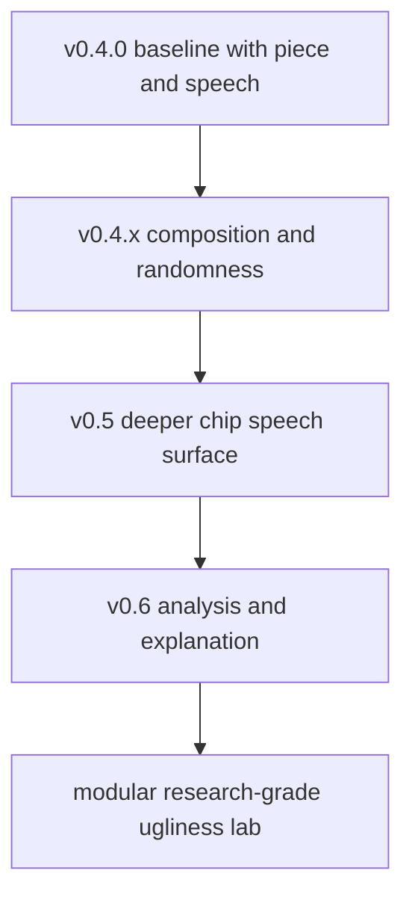

# Roadmap

This roadmap is meant to help people understand where `usg` is headed next, not to pretend every item is guaranteed.

The project is already strong at three things:

- rendering ugly sounds from scratch
- transforming existing sounds toward target ugliness
- analyzing results in transparent heuristic terms

The next milestones focus on making those surfaces deeper, more reproducible, and easier to explore.

## Current Baseline

As of the current `v0.6` docs slice, USG already includes:

- `render`, `piece`, `chain`, `go`, and `analyze` as the main product surface
- speech synthesis with chip-inspired profiles, profile-specific backend models, phoneme timelines, text normalization, and analysis export
- seeded reproducibility and controlled randomness knobs
- timeline and JSON analysis outputs
- analysis explanations with top score drivers, assumptions, and per-component contributions
- benchmark reports with timing and score-consistency fields
- contour-driven `go` processing and multichannel upmix workflows
- multichannel `piece` generation, including named Atmos-style layouts
- colored interactive progress feedback during piece assembly
- example corpus generation and repo verification scripts

## Near-Term Priorities

### `v0.4.x`: Composition And Randomness

Goal: make randomness and long-form generation feel like first-class composition surfaces rather than side options.

Planned work:

- expand seed controls so `render`, `speech`, `go`, `mutate`, `evolve`, and `marathon` expose a more uniform randomness contract
- keep the named randomness presets `stable`, `restless`, `feral`, and `catastrophic` aligned between CLI behavior and data presets
- expose separate timing, spectral, density, spatial, and articulation randomness on more commands
- add seed manifests so long-running batch jobs can be reproduced exactly from one file
- add “reroll just one layer” workflows for speech units, stages, and contours
- deepen `piece` with phrase-scale structure, section contrast, burst logic, and direct loading for reusable scene presets
- expand spatial composition beyond raw channel spread: motion curves, region constraints, and speaker-family targeting

### `v0.5`: Speech System Deepening

Goal: move from broad chip-speech variety toward more convincing and controllable speech design.

Current surface:

- text normalization is on by default for `speech`: curly quotes/dashes are simplified, whitespace is collapsed, digits become spoken words, and mixed-case text is uppercased before parsing; `--no-normalize-text` preserves raw input apart from line-ending cleanup
- the approximate parser now exposes diagnostics through `--timeline-json`: each rendered unit records source token, phoneme label, kind, timing, gap, emphasis, pitch, formants, voicing/noise flags, and active speech backend
- chip profiles are routed through chip-specific backend families: `lpc`, `formant-grid`, `sam-vocal-tract`, `arcade-pcm`, `delta-modulation`, `klatt-cascade`, and `psg-formant`
- twelve current profiles are available: `votrax-sc01`, `tms5220`, `sp0256`, `mea8000`, `s14001a`, `c64-sam`, `arcadey90s`, `handheld-lcd`, `speak-and-spell`, `macintalk`, `yamaha-psg`, and `amiga-narrator`
- three oscillator slots can be mixed per render with 34 oscillators plus 12 excitation families, covering tonal, noisy, nasal/formant, robotic, fractal, granular, and broken digital sources
- input tuning is explicit with `--input-mode auto|character|word|sentence|paragraph`, `--units-per-second`, word/sentence/paragraph gap controls, word accent, sentence lilt, paragraph decline, emphasis, attack, and release
- `speech-pack` renders every chip profile, analyzes each result, computes an intelligibility index, and ranks by `ugliness`, `intelligibility`, or `balanced`
- speech exports include WAV plus optional `--analysis-json` and `--timeline-json`; speech-pack writes JSON, CSV, and HTML reports

Still useful follow-up:

- add curated speech recipe metadata for specific eras, chips, and "wrong but useful" historical misbehaviors
- expand normalization beyond the current digit/case/punctuation cleanup into abbreviation-aware phrasing
- make phoneme diagnostics easier to read directly in terminal output, not only timeline JSON
- expose reusable speech preset discovery through `usg presets` once the data format settles

### `v0.6`: Analysis, Search, And Explanation

Goal: make the analyzer more useful for research, benchmarking, and guided exploration.

Current surface:

- `analyze --json` includes profile metadata, traceable assumptions, top score drivers, and per-component contribution rows
- `analyze --explain` prints a compact human-readable "why this scored ugly" summary
- benchmark JSON/CSV reports include timing plus score-consistency fields: average/min/max Colbys and score standard deviation
- timeline JSON/CSV remains stable for per-window analysis exports

Still useful follow-up:

- corpus-wide comparison reports that aggregate many files into one explainable summary
- stronger contracts for seeded reproducibility and profile stability across releases
- better analysis of multichannel and Atmos-style pieces, including spatial activity summaries

## Medium-Term Themes

### Architecture Cleanup

- continue splitting oversized modules so synthesis, CLI plumbing, analysis, and export logic are easier to evolve independently
- isolate speech engines, effect modules, and profile logic behind cleaner interfaces
- make long command handlers more composable and less coupled to stdout formatting

### Presets And Exploration

- grow the preset library for `chain`, `go`, speech profiles, and randomness recipes
- add curated “families” of ugly sound recipes with predictable intent
- improve preset discoverability in the CLI and docs
- keep the piece-scene presets `drone-field`, `failure-chamber`, `arcade-collapse`, and `alarm-choir` aligned between CLI behavior and data presets

## Preset Slice Landed

The docs/preset slice now has two recipe libraries that mirror first-class CLI behavior:

- `presets/randomness/`: named recipes for the existing randomness knobs, including `stable`, `restless`, `feral`, and `catastrophic`
- `presets/piece_scenes/`: reusable `piece` scene recipes with current CLI-compatible `example_command` strings and future-facing section intent

These files are intentionally data-first, while `--random-preset`, `piece --scene`, and `usg presets --kind randomness|piece-scene` provide the direct CLI hooks.

### Corpus And Research Support

- expand the reproducible example corpus with speech-heavy and analysis-heavy packs
- add more reference comparisons and scoring sanity checks
- make paper-inspired effects and psychoacoustic references easier to trace from CLI features back to documentation

## Long-Term Direction

The long-term ambition is for USG to be useful in three overlapping modes:

- an instrument for making intentionally ugly sound
- a lab bench for measuring, comparing, and steering ugliness
- a reproducible playground for chip speech, dissonance, and psychoacoustic weirdness

That means future work should keep balancing spectacle with clarity: more range, better docs, stronger contracts, and less hidden behavior.

## Recommended Next Focus

If we want the highest-payoff next step, it should be:

1. make `piece` more musical at the macro level with sections, ramps, rests, and return points
2. make speech more preset-driven at the recipe level with curated chip/era packs and terminal-friendly phoneme diagnostics
3. make analysis explain itself better so users can connect what they hear to what USG measured

That sequence keeps the repo balanced between instrument, composition tool, and research toy.

## Visual Track

